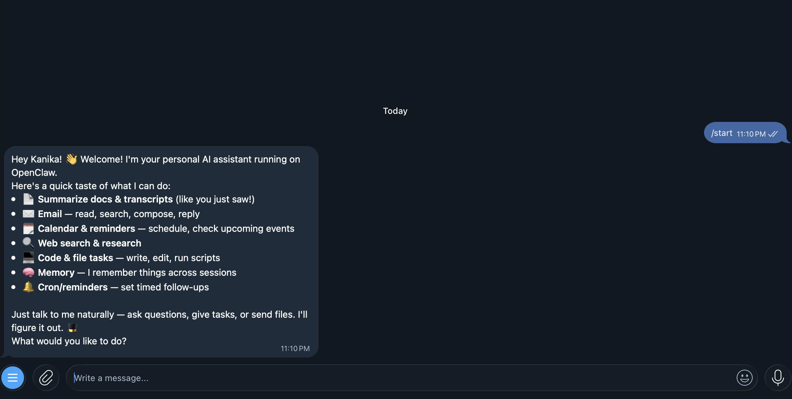
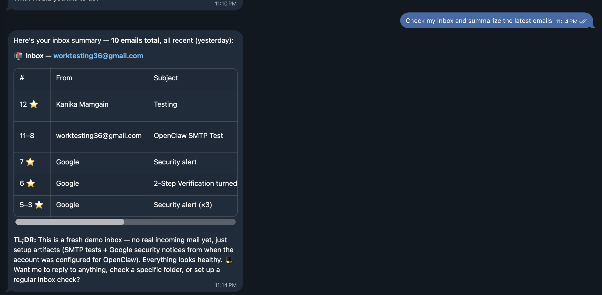
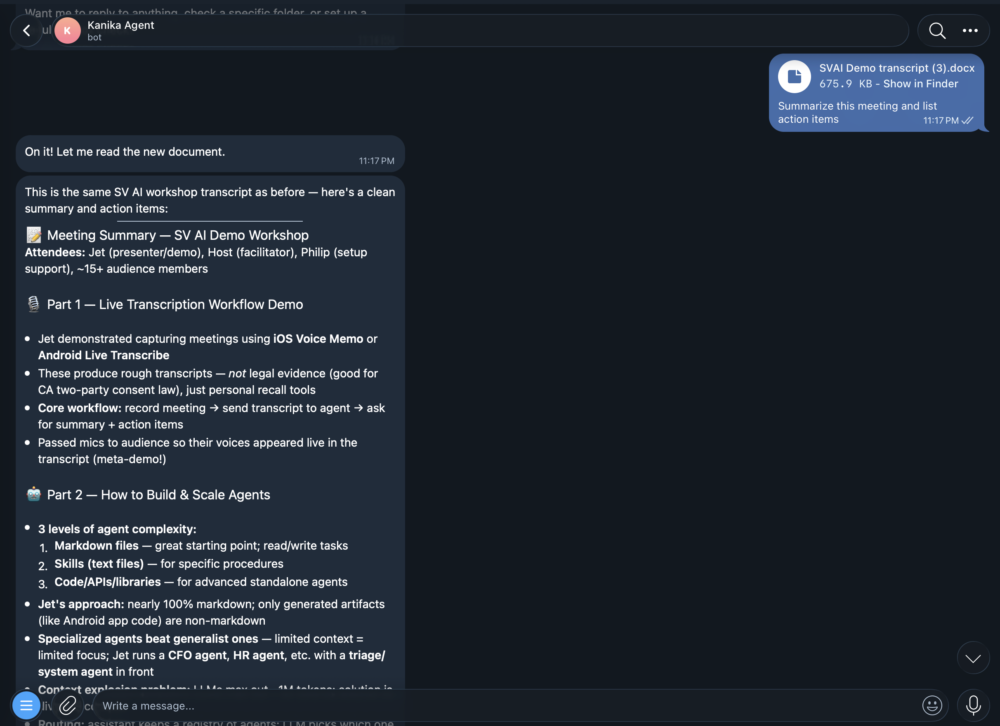
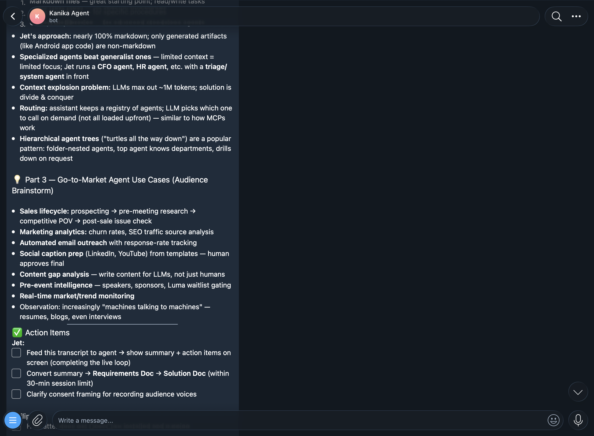

# OpenClaw Agent

A personal AI agent that runs in Docker, connects to Telegram, reads Gmail, and uses Claude as its brain.

---

## What It Does

- **Chat via Telegram** — send messages to your bot, get AI responses
- **Read & send Gmail** — agent can check and reply to your emails
- **Remember things** — session memory powered by local Ollama embeddings
- **Web Dashboard** — monitor and control your agent at `http://127.0.0.1:18789`

---

## Demo

### Agent Introduction


### Email Inbox Summary


### Meeting Transcript Summary



---

## Requirements

- [Docker Desktop](https://www.docker.com/products/docker-desktop/)
- [Ollama](https://ollama.com) running locally with `nomic-embed-text` model
- An [Anthropic API key](https://platform.anthropic.com)
- A Telegram bot token (create one via [@BotFather](https://t.me/BotFather))

---

## Setup

### 1. Clone the repo

```bash
git clone https://github.com/KanikaMamgai09/OpenClaw-Agent.git
cd OpenClaw-Agent
```

### 2. Create your `.env` file

```bash
cp .env.example .env
```

Open `.env` and fill in your secrets:

```
OPENCLAW_GATEWAY_PASSWORD=choose_a_password
ANTHROPIC_API_KEY=sk-ant-...
TELEGRAM_BOT_TOKEN=your_telegram_bot_token
```

### 3. Pull the Ollama embedding model

```bash
ollama pull nomic-embed-text
```

### 4. Run one-time setup

```bash
docker compose run --rm openclaw openclaw setup --non-interactive --accept-risk
```

This configures your agent (model, memory, persona) inside the shared Docker volume.

### 5. Start the gateway

```bash
docker compose up openclaw-gateway -d
```

Your agent is now running. Open Telegram and message your bot.

---

## Project Structure

```
OpenClaw-Agent/
├── compose.yaml          # Docker services definition
├── Dockerfile.gateway    # Custom image with Gmail (himalaya) support
├── entrypoint.sh         # Links Gmail config on container start
├── .env                  # Your secrets (never committed to git)
├── .env.example          # Template for .env
├── .gitignore            # Keeps .env out of git
└── sample-data/          # Example outputs and demo transcript
```

---

## Web Dashboard

After starting the gateway, open the URL shown in the terminal logs:

```
http://127.0.0.1:18789/#token=your_token_here
```

You can view conversations, memory, and agent status here.

---

## Stopping the Agent

```bash
docker compose down
```

Your data is safe — it lives in a Docker volume called `openclaw-workspace` and persists across restarts.
